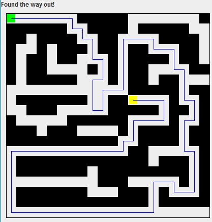

# Maze Viewer
A maze search project and GUI display using a recursive backtracking algorithm to navigate a user through a maze from start to finish. Read a maze from a file inputted in the command line. Press any key to show if there is a path to the end of the maze.  

## Maze path found
 

 

## Maze path not found
 

 

