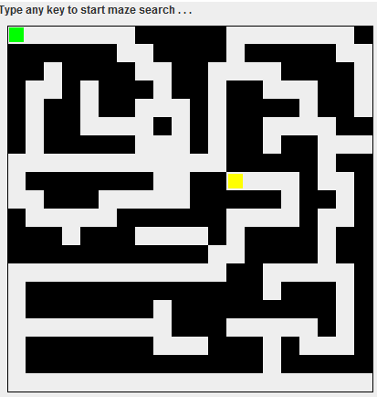
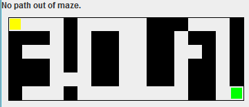

# Maze Viewer
A maze search project and GUI display using a recursive backtracking algorithm to navigate a user through a maze from start to finish. Read a maze from a file inputted in the command line. Press any key to show if there is a path to the end of the maze. 

The program inputs a text file in the following format:

4 5  
11011  
11011  
11000  
11110  
1 3  
4 5  

The first line is the size of the maze (row x column). The maze follows as the subsequent rows where a 0 indicates a free space and a 1 indicates a wall. The second to last line is the entry coordinates of the maze, and the last line is the exit coordinates. The entry location is yellow and the exit location is green. 

## Maze path found
 

 

## Maze path not found
 

 

